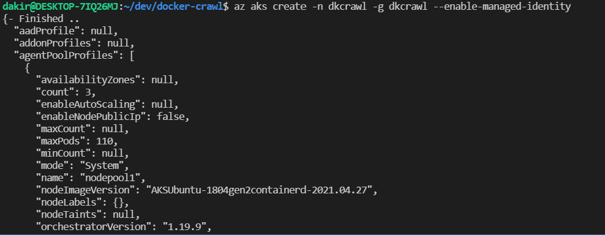
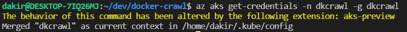
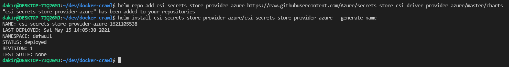

# docker-crawl

[](https://github.com/dkirby-ms/docker-crawl/actions/workflows/crawl-git-build.yml)
[](https://github.com/dkirby-ms/docker-crawl/actions/workflows/scoring-build.yml)

Docker container and Kubernetes manifests for Dungeon Crawl Stone Soup (DCSS), crawl-scoring, and eventually beem. Includes support for running on Microsoft Azure services including AKS, Keyvault, Azure AD B2C, Redis cache, and more. 

Forked from: [frozenfoxx/docker-crawl](https://github.com/frozenfoxx/docker-crawl)

## WARNING: some of the below is obsolete with the move to helm chart. will update later

## Prerequisites (INCOMPLETE)

* [Install Azure CLI](https://docs.microsoft.com/en-us/cli/azure/install-azure-cli)

* [Install Helm v3 or later](https://helm.sh/docs/intro/install/)

## Setup (INCOMPLETE)

* Configure webserver by editing ./crawl/webserver/config.py with your values. Note that trunk is configured here under the games OrderedDict
* Configure additional games (e.g., sprint, tutorial, zot, stable versions) by editing ./crawl/webserver/games.d/base.yaml
  * Note that stable versions are not currently building with the current docker-crawl image. If you want to run stable versions, you will need to either create new images or add them to the current docker-crawl image.
* Configure scoring:
  * Edit ./scoring/settings/nginx.conf and provide your server URL
  * Edit ./scoring/settings/sources.yml and provide your server URL and adjust paths to logfiles/milestones if needed
  * Edit ./scoring/settings/toplink.mako and provide your server URL
  * Edit ./scoring/settings/index.mako and provide your server URL
  * Edit ./webserver/banner.html to customize the Webtiles banner
* Configure Azure Files share and persistent volume
  * Create storage account for Azure Files share
  * Create k8s secret named azure-secret for storage account key
  * Create Azure Files share on storage account named crawlshare (edit [manifests/azurefiles.pv](manifests/azurefiles.pv) and [manifests/azurefiles.pvc](manifests/azurefiles.pvc) as needed)
* All player RCs and webserver database files are located within `/data` within the container. Bind mount a host directory or use a persistent volume claim to maintain persistence. Included manifests use Azure Files for persistence but you can adjust and use whatever makes sense for your environment.

## Deploy on AKS (INCOMPLETE)

* Create an AKS cluster with managed identity enabled
  
  ```shell
  az aks create -n <cluster name> -g <resource group> --enable-managed-identity
  ```

  

* Get the managed identity client id by running az aks show and make a note of the kubelet clientId for later use.

  ```shell
  az aks show -n <cluster name> -g <resource group>
  ```

  

* Get the AKS kubeconfig for your AKs cluster.

  ```shell
  az aks get-credentials -n <cluster name> -g <resource group>
  ```

  

* Install the Secrets Store CSI driver and the Azure Key vault provider for the driver.

  ```shell
  helm repo add csi-secrets-store-provider-azure https://raw.githubusercontent.com/Azure/secrets-store-csi-driver-provider-azure/master/charts
  helm install csi csi-secrets-store-provider-azure/csi-secrets-store-provider-azure --namespace kube-system
  ```

  

* Create Azure key vault and import a certificate.

* Configure your key vault to allow access to the AKS vnet.

* Set a key vault access policy to allow your AKS managed identity client id to get secrets and certificates.

* Create secrets and tls cert in keyvault

* Edit crawlapp/values.yaml with your values.

* Deploy Ingress controller (for AKS)

```shell
helm repo add ingress-nginx https://kubernetes.github.io/ingress-nginx
helm repo update
helm install ingress-nginx/ingress-nginx --generate-name \
    --set controller.replicaCount=2 \
    --set controller.nodeSelector."beta\.kubernetes\.io/os"=linux \
    --set defaultBackend.nodeSelector."beta\.kubernetes\.io/os"=linux \
    -f - <<EOF
controller:
  extraVolumes:
      - name: secrets-store-inline
        csi:
          driver: secrets-store.csi.k8s.io
          readOnly: true
          volumeAttributes:
            secretProviderClass: "azure-kvcrawl"
  extraVolumeMounts:
      - name: secrets-store-inline
        mountPath: "/mnt/secrets-store"
        readOnly: true
EOF
```

* Deploy Ingress controller (for minikube running on WSL2 without Docker Desktop)

```shell
kubectl apply -f https://raw.githubusercontent.com/kubernetes/ingress-nginx/controller-v0.46.0/deploy/static/provider/cloud/deploy.yaml
```

* Create storage account and fileshare

* helm install crawlapp ./crawlapp
